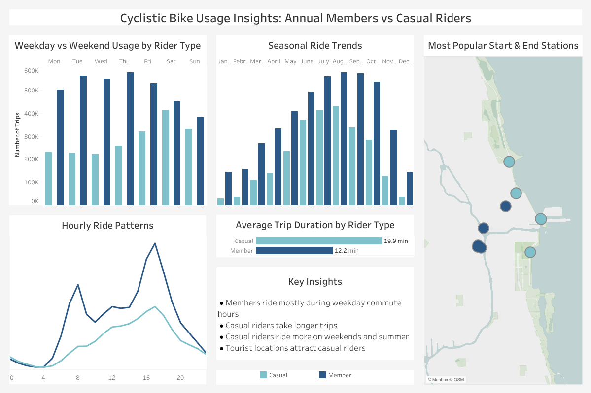

# Cyclistic-Bike-Share-Analysis
Case Study – Google Data Analytics Certificate

## Tableau Dashboard

## Project Overview

Cyclistic is a bike-share company in Chicago that offers single-ride passes, day passes, and annual memberships. The marketing team wants to increase the number of annual members because they provide more stable long-term revenue.

This project analyzes 12 months of trip data to understand how casual riders and annual members use Cyclistic bikes differently and identify opportunities to convert casual riders into annual members.

## Business Task

Identify behavioral differences between casual riders and annual members to support marketing strategies aimed at increasing annual memberships.

## Repository Structure
* data/ – sample dataset  
* sql/ – SQL queries used for analysis  
* dashboard/ – Tableau dashboard screenshot  
* README.md – project documentation

## Data Sourse

The dataset used in this analysis is publicly available and provided by Divvy Bike Share.
Trip data can be downloaded from:
https://divvy-tripdata.s3.amazonaws.com/index.html

The data includes historical trip information from the bike-share system operated in Chicago.
Personally identifiable information has been removed to protect rider privacy.

#### Dataset characteristics:
* 12 months of trip data from 2025
* ~5.5 million rides
* CSV files (one file per month)
* Contains ride start/end times, start/end station names, station coordinates, rider type, and bike type.

#### Sample Dataset

A small sample of the dataset structure (50 rows) is provided as CSV file.
The full dataset (5.5M+ rows) can be downloaded from the official source.

The data has been made available by Motivate International Inc. under this license:
https://divvybikes.com/data-license-agreement

## Tools Used 
* SQL (DuckDB) - Data cleaning and analysis
* Tableau - Data visualization and dashboard
* GitHub - Project documentation

## Data Preparation
Steps performed during data preparation:
* Imported 12 monthly CSV files into a SQL database
* Combined files into a single table
* Verified column data types
* Removed unrealistic trip durations (<1 minute or >24 hours)
* Calculated ride duration
* Extracted additional features: weekday, hour of day, month
* Listed most used start and end stations

## Key Analysis
The following aspects of rider behavior were analyzed:
* Ride frequency by weekday
* Ride frequency by month
* Ride frequency by hour of day
* Average ride duration
* Most popular stations

The goal was to identify behavioral differences between casual riders and annual members.

## Key Findings
#### 1. Members ride mainly during commute hours
Annual members show clear peaks around 7 - 8 in the morning and 4 - 7 in the evening, suggesting bikes are used for commuting.

#### 2. Casual riders take longer trips
Average ride duration of annual member is ~12 minutes, of casual member ~20 minutes.

#### 3. Casual riders peak during weekends and summer
Casual riders appear to use bikes more during weekends and summer monyhs, suggesting usage primarily for leisure or tourism.
Members ride more consistently throughout the week and across seasons.

#### 4. Popular stations differ
Members commonly start and end rides near business districts, while casual riders frequently start and end near tourist attractions.

## Tableau Dashboard

The final Tableau dashboard highlights key usage patterns between rider types.
Visualizations include:
* rides by weekday
* rides by month
* rides by hour of day
* average trip duration
* most popular stations

## Recommendations

Based on the analysis, the following strategies could help convert casual riders into annual members:

#### 1. Promote memberships during peak casual usage periods

Target weekend and summer riders with membership discounts or trial offers.

#### 2. Offer leisure-focused membership benefits
Create incentives such as free extra ride time on evenings and weekends.

#### 3. Partner with local attractions
Offer promotions connected to popular destinations like Navy Pier or Millennium Park.

## Author

Aleksandra Doroshenko

Junior Data Analyst Portfolio Project

## Acknowledgements
This project was completed as part of the Google Data Analytics Certificate.

AI tools were used during the learning process to help review SQL queries, clarify concepts, and improve documentation. All analysis, data processing, and conclusions were performed and validated by the author.
